---

title: Thymeleaf

author: Umakant Nishad

date: 2020-08-13

hero: ./images/thymeleaf.png

slug: thymeleaf basic concepts

excerpt: In this article, we will explore the various concepts related to Thymeleaf.

---
##What is Thymeleaf?

    • Thymeleaf is a java template engine, Commonly used to generate the HTML views for the web.
    • It is a general-purpose template engine which is capable of both web and standalone environment to generate dynamic views.
    • It is a separate project, unrelated to spring we can create views without the use of spring.
      
##Thymeleaf template

    • A thymeleaf template can be a combination of HTML tags with some thymeleaf expressions. 
    • It includes dynamic content to an HTML page with the help of thymeleaf expressions.
    • It can access java code, objects, spring beans, and so on.

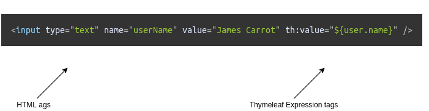

##Thymeleaf template processing?

Thymeleaf can process **six** kinds of templates out of the box.
each of them is called Template Mode.

    • XML
    • Valid XML
    • XHTML
    • Valid XHTML
    • HTML5
    • Legacy HTML5

##Thymeleaf Engine

**Thymeleaf Engine**, It is used to parse the thymeleaf template. With the help of Java model data to show the content on the HTML page.
Here is the screenshot of thymeleaf template working:

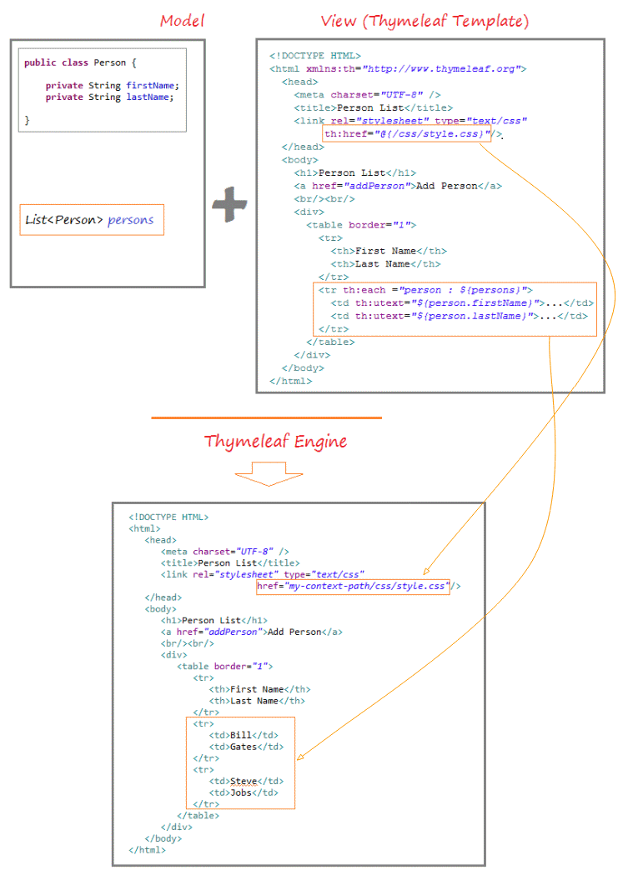

##Thymeleaf template working?

In a web app, thymeleaf is processed on the server. The processed result included in the HTML and then  return to the browser.

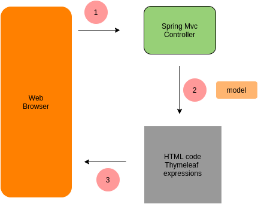

##Thymeleaf vs JSP

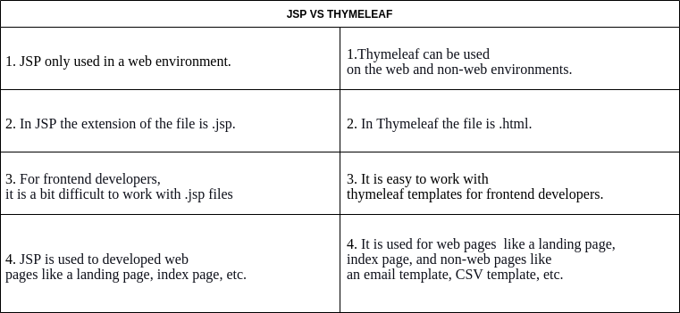

##Process for adding thymeleaf in a project

####Step 1:Add thymeleaf to maven pom file.

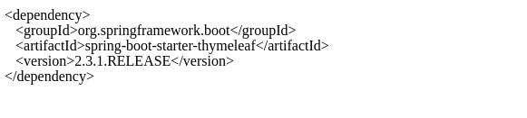

#####Step 2: Create a Spring MVC controller.

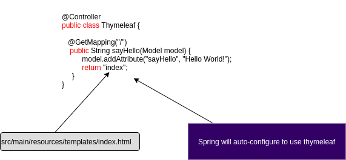

####Step 3: Create the Thymeleaf template.

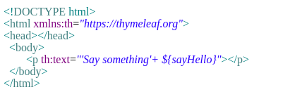

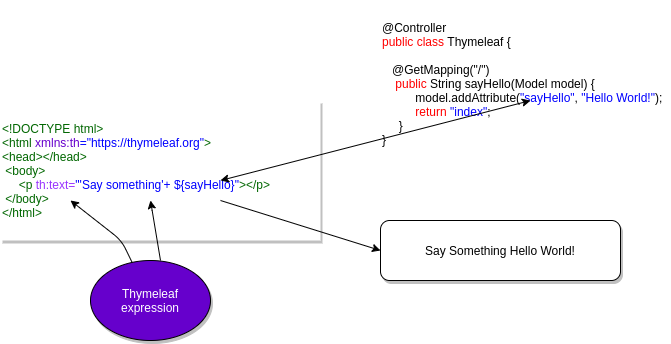

##Additional Features of Thymeleaf

    • Looping and conditions.
    • CSS and JavaScript integration.
    • Template layouts and fragments
      

##Using CSS with Thymeleaf Template

we have the option of using

    • Local CSS file as a part of your project.
    • Remote CSS file references.

Let’s learn CSS as a local file.

Spring boot will look for static resources in a static resource directory.

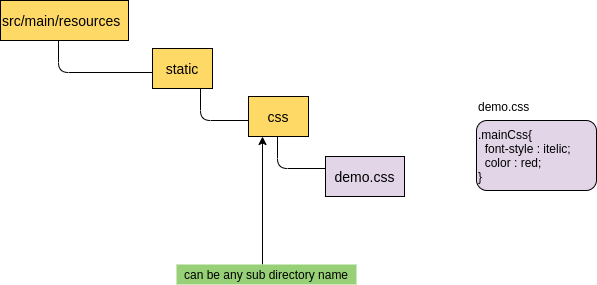

####To link the CSS file using the thymeleaf tag.

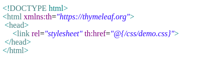

####To link JavaScript file using thymeleaf tag.

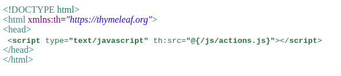

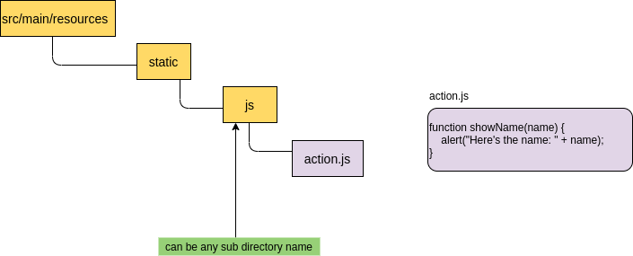

##Standard dialects?

In thymeleaf, you can define your own set of tags with the name you want. Thymeleaf comes with a set of standard dialects(Spring Standard) which are more than sufficient for basic operations.
we can identify these standard dialects with prefix **th** prefix.

##Thymeleaf Standard Expression syntax

These are the standard thymeleaf expression syntax are used to perform different types of a task such as the declaration of variables. They are also used to includes the external static files such as CSS and JavaScript etc. By default, it supports five types.

    • Variable expressions:- ${...}.
    • Selection expressions:- *{...}.
    • Message (i18n) expressions :- #{...} .
    • Link (URL) expressions :- @{...} .
    • Fragment expressions:- ~{...}.
      

##Conclusion
  
    • Thymeleaf is a modern and natural template engine that reduces the gap between frontend and backend developers.
    • It provides both web and non-web implementation functionalities.
    • It can process spring beans and java objects which make it more useful.
    • It can process multiple languages and It has better expression language then spring.